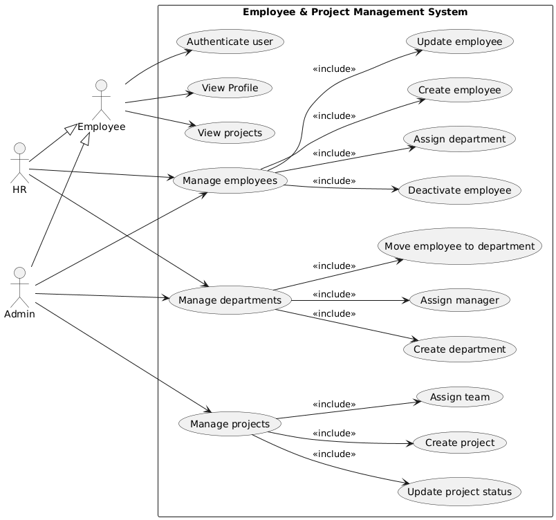

# **Technical Use Case Document**

## **UC-1: User Login**

| **Field** | **Description** |
|------------|----------------|
| **Use Case ID** | UC-1 |
| **Use Case Name** | User Authentication |
| **Actors** | Employee, HR, Admin |
| **Description** | Allows users to securely log in using their credentials. |
| **Main Flow** | 1. User enters username/email and password. 2. System validates credentials. 3. System generates JWT token. 4. User is redirected to their dashboard. |
| **Alternate Flow** | Invalid credentials → Show error message and remain on login page. |

---

## **UC-2: Manage Employee Data**

| **Field** | **Description** |
|------------|----------------|
| **Use Case ID** | UC-2 |
| **Use Case Name** | Manage Employee Information |
| **Actors** | HR, Admin |
| **Description** | HR or Admin can add, edit, update, or delete employee records. |
| **Main Flow** | 1. HR/Admin opens Employee Management. 2. Chooses Add/Edit/Delete. 3. Enters or updates details and submits. 4. System validates and saves data. 5. System shows confirmation. |
| **Alternate Flow** | Data validation fails → Display field-level errors and prevent save. |

---

## **UC-3: Manage Departments**

| **Field** | **Description** |
|------------|----------------|
| **Use Case ID** | UC-3 |
| **Use Case Name** | Department Management |
| **Actors** | Admin |
| **Description** | Admin creates, updates, or deletes department information and links employees. |
| **Main Flow** | 1. Admin opens Department module. 2. Adds or updates department details. 3. Assigns employees to department (optional). 4. System validates and saves. 5. System confirms success. |
| **Alternate Flow** | Duplicate department code → Show error and block save. |

---

## **UC-4: Manage Projects**

| **Field** | **Description** |
|------------|----------------|
| **Use Case ID** | UC-4 |
| **Use Case Name** | Project Management |
| **Actors** | Admin, HR |
| **Description** | Create and update projects, assign employees, and set roles within each project. |
| **Main Flow** | 1. Admin/HR opens Project Management. 2. Creates or edits project (name, dates, description). 3. Assigns employees and roles. 4. Saves changes. 5. System confirms success. |
| **Alternate Flow** | Missing required project or assignment data → Validation errors. |

---

## **UC-5: Enforce Role-Based Access Control (RBAC)**

| **Field** | **Description** |
|------------|----------------|
| **Use Case ID** | UC-5 |
| **Use Case Name** | Enforce Role-Based Access Control |
| **Actors** | Employee (Normal User), HR, Admin |
| **Description** | The system enforces permissions so that only HR/Admin can perform restricted operations (like modifying employee data, departments, or projects). Normal users are limited to allowed actions. Unauthorized API or route access is blocked. |
| **Main Flow** | 1. User calls a protected API/route. 2. Middleware verifies JWT and extracts role. 3. System checks role-based permissions. 4. If authorized → Proceed with the action. 5. If unauthorized → Return “Access Denied” message. |
| **Alternate Flow** | Missing or expired token → Return 401 Unauthorized. |

---

## **Future Use Cases**

### 1. **Leave Request and Approval System**
**Description:**  
Allow employees to submit leave requests, which can then be reviewed and approved/rejected by HR or Admin.

---

### 2. **Employee Feedback and Review System**
**Description:**  
Implement a feedback mechanism where employees can submit performance reviews for peer evaluation.

---

### 3. **Attendance and Time Tracking (Optional Future Extension)**
**Description:**  
Enable attendance tracking and monitoring of employee working hours.

---

### 4. **Payroll and Salary Management (Long-Term Enhancement)**
**Description:**  
Automate payroll calculation based on attendance, leaves, and performance data.

---

